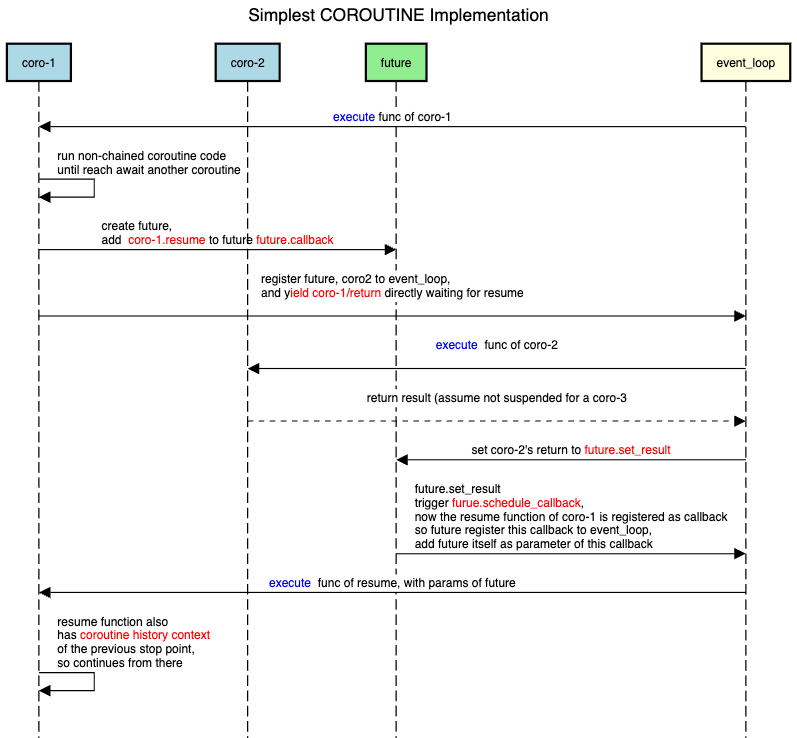
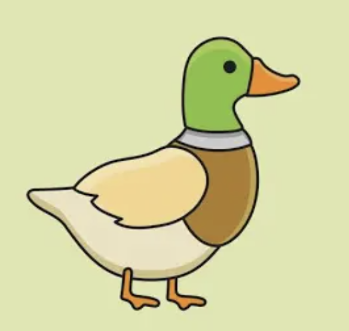

# DabDab 

DabDab is a project to explore model prototypes.
Current exploration is the coroutine model (theory and implementation) with python, lua, and golang.

### Coroutine

#### Smallest Model

  

